Generica // Ein Regelwerk für erzählerisches Fantasy-Rollenspiel
================================================================

Einleitung
----------

### Wie funktioniert Rollenspiel?

Klassisches Pen-und-Paper-Rollenspiel kann man sich als eine Mischung
aus Geschichtenerzählen, Improvisationstheater und Würfelspiel
vorstellen: Es gibt die Schauspieler, genannt "Spieler", und es gibt
einen Regisseur und Drehbuchautor, genannt "Meister". Jeder Spieler
verkörpert und belebt eine feste Hauptrolle, den "Helden", während
der Meister die Spielwelt ins Leben ruft, die Nebenrollen besetzt und
Regelentscheidungen trifft. Regelentscheidungen? Ganz richtig! Es geht
beim Rollenspiel nicht nur um das Ausspielen eines Charakters, sondern
hin und wieder werden auch die Würfel gerollt. Hierbei hat jeder
Held besondere Fähigkeiten: So kann ein Ritter die Klinge sprechen
lassen, eine Diebin dagegen schleichen und stehlen. Diese Fähigkeiten
werden auf einem Blatt Papier, dem Charakterbogen, festgehalten.

Beim Rollenspiel gibt es viele verschiedene Spielarten: Jede Gruppe
von Rollenspielern hat ihre bevorzugten Varianten. Variiert werden zum
Beispiel das Genre der Geschichte, von Fantasy über Science Fiction
bis hin zu Gothic Horror, oder der Spielstil, von erzählerischem
über realistischen bis hin zu Würfelspiel-betontem Stil. Einige
Regelwerke eignen sich dabei besser für bestimmte Spielstile und
Genres als andere. Dieses System hier, __Generica__, ist gedacht
für einen erzählerischen Spielstil im Fantasy-Genre.
 
Nun, wie funktioniert also Rollenspiel? Hier ein Beispiel:

    Meister: 
        "Langsamen Schrittes steigt ihr die Treppe hinab, der Weg nur
        erleuchtet vom Schein von Tristanias Fackel. Spinnweben säumen
        die Wände aus Lehmziegeln, die Luft riecht feucht und modrig.
        Von irgendwo dort unten aus der Gruft hört ihr das leise
        Weinen eines Kindes. Tristania, für einen Augenblick greift
        Furcht nach Deinem Herzen, Deine Nackenhaare stellen sich auf."
    
    Spielerin Lotte (Tristania): 
        "Mit klopfendem Herzen halte ich inne, deute meinen Gefährten
        an, stehenzubleiben, und horche angespannt in die Dunkelheit."
    
    Spieler Björn (Arton der Starke): 
        "Meine Hand geht zum Knauf meines Schwertes."
    
    Arton der Starke (Björn): 
        (Laut) "Tristania, was ist denn?"
    
    Tristania (Lotte):
        (Zischt) "Pssst! Hörst Du das nicht?"
    
    Arton der Starke: 
        (Kratzt sich an der Stirn)
        (Jetzt leise) "Was denn? Kannst Du da unten was erkennen?"
        
    Tristania:
        (Angst in den Augen)
        (Zischt) "Ich könnte schwören, da unten weint ein Kind!"
    
    Vesana Rabenfels (Katrin): 
        (Mit fester Stimme)
         "Ja, auch ich habe die Stimme vernommen! Dieser Ort
         ist verflucht! Aber verzagt nicht, meine Gefährten,
         ich habe schon so manchen Geist das Fürchten gelehrt!"
        
    Spielerin Katrin (Vesana): 
        "Ich lasse meinen Talisman aus meinem Beutel
        gleiten. Verspüre ich die Nähe von Übernatürlichem?"
         
    Meister:
        "Beschreib mal, was tu tust."
        
    Katrin (Vesana):
        "Ich nehme meinen Talisman, ein aufwändig graviertes goldenes
        Amulett mit einem Raben aus Opal darauf, und lasse ihn an
        seiner Kette langsam im Kreis pendeln. Ich schließe meine
        Augen und konzentriere mich nur auf die Bewegungen der Kette
        in meinen Fingern. Ich spüre den Sog der Geisterwelt, und
        als ich meine Augen öffne, ist alles um mich herum in fahlen
        weißen Nebel getaucht: Ich blicke hinaus in die Zwischenwelt."
     
    Meister:
        "Beschwörungsmagie-Probe gegen 4!"
    
    Katrin (Vesana):
        (Würfelt) "Geschafft!"
    
    Meister:
        "Du starrst vorbei an Deinen Freunden, sie sind in
        dieser Welt nur bleiche Schatten, und was Du dort unten
        in der Gruft siehst, lässt Dir das Mark gefrieren..."

So oder so ähnlich könnte eine Situation an einem gewöhnlichen
Rollenspiel-Abend ablaufen. Der Meister setzt die Helden in einer
Abenteuergeschichte aus und beschreibt, was vor sich geht. Die
Spieler beschreiben die Handlungen ihrer Helden und sprechen deren
Rollen. Die Handlungen werden dabei üblicherweise in der ersten
Person beschrieben, damit jeder Spieler vollkommen in die Spielwelt
eintauchen kann. Aus selbem Grund ist es auch üblich, dass der
Meister die Spieler mit den Namen ihrer Charaktere anspricht.
Obwohl der Meister eine grobe Idee hat, wie die Geschichte ablaufen
könnte, so entwickeln sich die meisten Situationen spontan durch die
Handlungen der Spieler. Meister und Spieler gehen auf einander ein
und gestalten die Geschichte gemeinsam. In manchen Situationen, wie
z.B. dem Kampf gegen eine Horde niederträchtige Gegner, spielt aber
auch der Zufall, repräsentiert durch die Würfel, eine große Rolle:

    Meister: 
        "Als Ihr gerade die Pferde festgemacht habt, da lösen
        sich aus dem Unterholz drei Gestalten. Einer der Räuber
        hat einen Dolch zwischen den Zähnen, ein anderer ist
        klein, schmierbäuchig und hält einen rostigen Säbel,
        der dritte ist groß, mit einfältigem Blick und grober
        Nase, und hält einen Holzknüppel in der schwieligen Hand.
        
        Kampf! 
        
        Der Räuber mit dem Dolch geht sofort auf Dich los, Vesana.
        Der Große gibt ein Grunzen von sich und stürzt sich auf Dich,
        Tristania. Der Kleine mit dem Säbel schreit 'Jetzt seid ihr
        fällig!' und geht zum Angriff auf Dich über, Arton. Ok,
        Tristania, Du hast die höchste Initiative und fängst an."
        
    Spielerin Lotte (Tristania):
        "Gut. Ich ziehe meinen Degen und greife den Großen an."
        
    Meister:
        "Er hat Kämpfen 4, also würfel mal einen Angriff gegen 14."
    
    Lotte (Tristania):
        (Würfelt)
        "Geschafft! 7 Trefferpunkte!"
        
    Meister:
        "Alles klar. Er trägt keine Rüstung und kassiert 7 volle
        Schadenspunkte. Beschreibung!"

    Lotte (Tristania):
        "Der Große ist behäbig und hat nicht bemerkt, wie ich
        mich so positioniert habe, dass er einen Satz über unser
        Kochgeschirr machen muss. Gerade als er das tut, mache ich einen
        Ausfallschritt und trete auf den Henkel einer Pfanne, die unter
        ihm liegt. Die Pfanne schießt in die Luft und - zaack - trifft
        ihn mitten ins Gemächt. Während er sich noch schmerzverzerrt
        krümmt, habe ich bereits meinen Degen gezogen und ihm mit zwei
        schnellen Hieben ein blutiges X in die Seite geschlagen."
        
    Meister:
        "Schön, dann ist er jetzt dran. Was hast Du in Kämpfen?"
        
    Lotte (Tristania):
        "9!"
        
    Meister:
        "Dann bist Du viel besser als er." 
        (Würfelt) 
        "Nicht geschafft. Das sind also nur 3 Trefferpunkte.
        Wütend holt er zu einem kräftigen Schlag aus, aber weil
        er sich zu dir umdrehen muss, stolpert er über einen
        Eurer Wasserschläuche, die dort auf dem Boden herumliegen.
        Sein Knüppelhieb streift Dich nur an der Schulter.
        So, wer ist der nächste? Ah, Arton, Du bist dran."

Beim Kampf wird also viel gewürfelt, und über Schadenspunkte Buch
geführt. All das ist verpackt in actiongeladene Beschreibungen!

### Zielsetzung

__Generica__ ist ein Rollenspielregelwerk, das auf schnelle
Spielbarkeit und einen erzählerischen Spielstil ausgelegt ist. Zum
einen sollen Kämpfe schnell und planbar abgehandelt werden, zum
anderen soll der Aufwand für die Charaktererschaffung möglichst
gering gehalten werden. Warum? Ein erzählerischer Spielstil ohne
viel Simulation und Würfelspiel macht nicht nur Spaß, er ist auch
einsteigerfreundlich: Eine Rolle spielen und Aktionen beschreiben
kann jeder aus dem Stehgreif, ein kompliziertes Würfelspiel spielen
nicht. Zudem erleichtert ein schnelles Regelwerk das Spielen von
"_de-novo_-One-Shots", also Abenteuern, die ohne große Vorbereitung und
ausgearbeitete Helden an ein oder zwei Abenden gespielt werden können.

### Design

Ein Hauptaugenmerk von __Generica__ liegt in der Implementation des
[Kampfsystems](#Kampfsystem), da Kämpfe generell die regellastigsten
Situationen im Rollenspiel sind. Kämpfe mit __Generica__ dauern im Normalfall
zwischen 5-8 Kampfrunden, und ihr Ausgang ist gut vorhersagbar. Die
Spielzeit eines Kampfes wird im Regelfall vollständig vom Umfang der
Beschreibungen bestimmt und liegt bei vier Helden erfahrungsgemäß
bei etwa 30-60 Minuten. Eine Besonderheit des Kampfsystems ist, dass
jeder Angriff prinzipiell ein Treffer ist; es können also auch Spieler
eines Nicht-Kämpfer-Charakters aktiv am Geschehen teilnehmen und sich
schöne Beschreibungen einfallen lassen (nichts ist langweiliger,
als Runde für Runde seinen Angriffswurf nicht zu schaffen). Kämpfe
kosten daher vergleichsweise viele Lebenspunkte: Auch Charaktere mit
viel Kampferfahrung nehmen Schaden und müssen sich hin und wieder
um Heilung bemühen. Charaktere mit Fähigkeiten wie Heilzauberei,
Alchemie, Wundversorgung sind also immer gefragt. Die Ausrüstung beim
Kampf spielt eine große Rolle: Schwerter sind deutlich gefährlicher
als Dolche, das Tragen einer Rüstung ist ein entscheidender Vorteil.

Der zweite Schwerpunkt von __Generica__ liegt auf einem einfachen
[Charaktersytem](#Charaktererschaffung): Charakterklassen gibt es nicht.
Charaktere haben nur drei Grundeigenschaften, die die Basis für eine
Handvoll abgeleiteter Statistiken sind. Bei der Charaktererschaffung
können Helden durch den Erwerb von Vor- und Nachteilen mit zusätzlichen
Besonderheiten ausgestattet werden. [Talente](#Talentliste) sind
möglichst generalisiert gehalten, mit einigen "nützlichen" Kerntalenten
wie _Kämpfen_, _Schleichen_ und _Sinnenschärfe_, und anderen eher
Rollenspiel-bezogenen Talenten wie _Zechen_, _Kochen_ oder _Musizieren_.

Ein weiterer Aspekt von __Generica__ ist regeltechnischer Freiraum und
die Ermutigung zur Fantasie: Es ist ausdrücklich erwünscht, dass Spieler
nicht nur Persönlichkeit und Hintergrund ihres Helden erschaffen,
sondern sich in Absprache mit dem Meister bei Bedarf auch individuelle
Vor- und Nachteile, Talente etc. ausdenken. Dies kommt besonders bei
der Zauberei zum Tragen. Das [Zaubersystem](#Zaubersystem) ist stark
generalisiert und kommt größtenteils ohne vorgegebene Zaubereffekte
aus: Vor jedem Abenteuer (oder jeder Sitzung) werden eine Handvoll
möglicher Zauber mit dem Meister ausgehandelt; Freizauberei, d.h. die
Anwendung frei ausgedachter situationsspezifischer Effekte, ist möglich,
kann vom Meister aber mit zusätzlicher Strenge gehandhabt werden.
Warum? Zauberei im Rollenspiel hat von jeher das Problem, dass sie
starken Einfluss auf den Verlauf einer Situation haben kann, und unter
Umständen sogar das ganze Abenteuer torpediert. Man stelle sich etwa
vor, dass in einem Kriminalfall-Abenteuer der Schurke gleich zu Anfang
mithilfe eines Gedankenlesezaubers enttarnt wird. Einige Effekte sind
in manchen Abenteuern unproblematisch, in anderen aber nicht. Zauberei
also vollständig einem reglementierten System mit fest verbrieften
Effekten zu überlassen, ist häufig nicht von Vorteil. Stattdessen
hat der Meister bei __Generica__ vor jedem Abenteuer (bzw. vor jeder
Sitzung) die Möglichkeit, unerwünschte Effekte zu verwehren, und dafür
andere von den Spielern gewünschte Effekte zuzulassen. Die Möglichkeit
zur Freizauberei kann dann zusätzlich tolle Rollenspielsituationen
ermöglichen, die mit festgelegten Effekten nicht zustande kämen.

Die Namensgebung für Statistiken in __Generica__ ist weitestgehend
dem Regelwerk von __Das Schwarze Auge (DSA)__ entlehnt. Dies ist
das erste Rollenspielsystem, das der Autor verwendet hat, und hat
daher eine vertraute Nomenklatur. Des weiteren ist das [Talent- und
Eigenschaftssystem](#Eigenschaften) von __Generica__ im Wesentlichen
eine stark reduzierte Version des entsprechenden Bereichs von __DSA__.
__Generica__ ist allerdings nicht auf den Einsatz in Aventurien
spezialisiert: Es ist gedacht für das Spiel in beliebigen Fantasy-Welten.

Charaktererschaffung und -steigerung {#Charaktererschaffung}
------------------------------------

### Was ist ein Charakter?

Ein Charakter (oder "Held") ist die Rolle, die von einem Spieler
über einen, mehrere oder viele Spielabende verkörpert wird. Im Kern
besteht der Charakter aus "Persönlichkeit" und "Fähigkeiten". Bei
der Persönlichkeit sind der Fantasie des Spielers keine Grenzen
gesetzt, solange die anderen Spieler und der Meister einverstanden
sind. So kann der Charakter zum Beispiel ein edelmütiger Ritter,
ein verschlagener Dieb, ein eitler Edelmann, ein versoffener
Söldner, ein hochnäsiger Zauberer, eine rachsüchtige Amazone,
eine stille Jägerin, eine spielsüchtige Seefahrerin, oder etwas
ganz anderes sein. Der Charakter kann und soll nach Belieben
mit Persönlichkeitsmerkmalen, einer Hintergrundgeschichte und
Ansichten zu Göttern, Politik, Sklaverei, Schnapsgenuss und Hurerei
versehen werden. Diese Rolle wird dann, wo es darauf ankommt,
nämlich bei den Fähigkeiten des Charakters, durch das Regelwerk
in Werte gegossen. Die Werte werden dabei auf dem Charakterbogen
festgehalten. Alle Werte werden bei der Erschaffung eines Charakters
mit [Abenteuerpunkten (AP)](#Abenteuerpunkte) erkauft, und können im
Verlauf des Spiels durch zusätzlich erworbene AP verbessert werden.

### Abenteuerpunkte (AP) {#Abenteuerpunkte}

AP sind "Belohnungspunkte", die der Meister am Ende einer
Rollenspielsitzung an die Spieler vergibt. Sie dienen dazu, die
Fähigkeiten eines Charakters zu verbessern oder zu erweitern. Im
Regelfall wird ein Rollenspielabend mit etwa 400 AP pro Spieler belohnt,
aber natürlich kann der Meister hier schalten und walten, wie er möchte.
Zu Beginn des Spiels, bei der Erschaffung eines Charakters, stehen
jedem Spieler 12.000 AP zur Verfügung. Diese kann er für den Erwerb
von [Eigenschaftspunkten](#Eigenschaften), [Talentpunkten](#Talente)
und [Vorteilen](#Vorteile) ausgeben. Gibt der Spieler bei der
Charaktererschaffung nicht alle AP aus, so werden die restlichen Punkte
dem AP-Konto des Charakters gutgeschrieben. Diese und weitere AP, die
sich der Charakter später dazuverdient hat, können dann zum Kauf neuer
Fähigkeitspunkte eingesetzt werden. Dies geschieht üblicherweise vor
oder nach einer Rollenspielsitzung, nicht aber während des Spiels.

### Die Steigerungskostentabelle (SKT)

Für den Kauf eines Eigenschafts- oder Talentpunktes können die
AP-Kosten in der Steigerungskostentablle (SKT) abgelesen werden.
Generell gilt: Je höher der aktuelle Wert der Eigenschaft oder des
Talents, desto teurer ist der Erwerb eines zusätzlichen Punktes.
Die SKT hat zwei primäre Spalten: Eine für Eigenschaftspunkte
(teuer), und eine für Talentpunkte (billiger). Jede dieser Spalten
ist zweigeteilt. Die jeweils linke Spalte gibt die Kosten für den
Kauf eines einzelnen Punktes an, die jeweils rechte Spalte führt die
kumulativen Kosten auf. Möchte man also den vierzehnten Punkt eines
Talentes kaufen, so schlägt man die Kosten in Zeile vierzehn, linke
Spalte nach. Möchte man ein Talent hingegen von 0 auf 5 steigern,
so schlägt man die Kosten in der fünften Zeile, rechte Spalte nach.

            Talente                Eigenschaften       
            --------------------   --------------------
    Wert                       ∑                      ∑
    -----   ---------    -------   ---------    -------
        1         120        120         400        400
        2         120        240         400        800
        3         120        360         400       1200
        4         120        480         400       1600
        5         180        660         400       2000
        6         180        840         400       2400
        7         180       1020         400       2800
        8         180       1200         400       3200
        9         180       1380         600       3800
       10         270       1650         600       4400
       11         270       1920         900       5300
       12         270       2190         900       6200
       13         270       2460         900       7100
       14         270       2730        1350       8450
       15         400       3130        1350       9800
       16         400       3530        1350      11150
       17         400       3930        1350      12500
       18         400       4330        2000      14500
       19                               2000      16500
       20                               2000      18500
       21                               2000      20500
    ---------------------------------------------------
    
    Beispiel:
        Die Steigerung eines Talents von TaW 14 auf 15 kostet 400 AP.
        Die Steiguerng eines Talents von TaW 0 auf 10 kostet 1650 AP.
        Die Steigerung einer Eigenschaft von 14 auf 15 kostet 1350 AP.

### Eigenschaften {#Eigenschaften}

Die Eigenschaften eines Charakters bilden dessen körperliche und
geistige Qualitäten ab. Jeder Charakter hat drei Eigenschaften:
Körperkraft (KK), Geschicklichkeit (GE) und Klugheit (KL), deren
Namen selbsterklärend sind. Die Werte der Eigenschaften rangieren
in der Region von 8 bis 21, und werden bei der Charaktererschaffung
zunächst standardmäßig auf 10 gesetzt. Durch Ausgeben von AP
können die Eigenschaften gesteigert werden, durch Senken der
Eigenschaften auf im Regelfall bis zu 8 Punkte können bei der
Charaktererschaffung zusätzliche AP freigemacht werden. Generell
lassen sich die Wertebereiche der Eigenschaften in etwa so bezeichnen:

    1-7:    Eines Helden nicht würdig
    8-9:    Unterdurchschnittlich
    10:     Durchschittlich
    11-13:  Gut
    14-15:  Hervorragend
    16-18:  Überragend
    19+:    Legendär

### Talente {#Talente}

[Talente](#Talentliste) spiegeln die Erfahrung und das Wissen eines
Charakters wieder. Je höher der Talentwert (TaW), desto größer die
Fähigkeiten des Charakters auf dem jeweiligen Gebiet. Es ist vollkommen
dem Spieler überlassen, ob ein Charakter zu Beginn in wenigen Talenten
gut geübt oder in vielen Talenten weniger geübt ist. Der Wertebereich
eines Talents geht von 0 bis 18, und lässt sich etwa so unterteilen:

    0:      Ungeübt
    1-4:    Lehrling
    5-9:    Geselle
    10-14:  Meister
    15-17:  Großmeister
    18:     Legende
    
[Zaubertalente](#Talentliste) können nur von Charakteren gesteigert
werden, die über den Vorteil _Astralkraft_ verfügen. Eine weitere
Besonderheit ist das Talent _Kämpfen_. Dieses wird ganz normal
bis zu TaW 9 gesteigert, aber ab TaW 10 werden die Punkte einer
_Waffenmeisterschaft_ zugeordnet, d.h. auf den Umgang mit einer
spezifischen Waffengattung spezialisiert. Eine _Waffenmeisterschaft_
wird dabei wie ein separates Talent gehandhabt. Ein Held kann beliebig
viele Waffenmeisterschaften erwerben, muss diese jedoch separat steigern. Die Waffenmeisterschaften sind:

    Unbewaffnet
    Dolche
    Fechtwaffen
    Schwerter/Säbel
    Hiebwaffen
    Kettenwaffen
    Speere/Stäbe
    Fernkampfwaffen

    Beispiel:
        Arton hat Kämpfen 9, und steigert die Waffenmeisterschaft
        "Schwert" auf 13. Mit seinem Schwert kämpft er nun also
        mit TaW 13, mit seinem Dolch hingegen nur mit TaW 9. Nach
        einer weiteren Sitzung hat er genügend AP, um auch eine
        Waffenmeisterschaft für den Dolchkampf zu erwerben. Er steigert
        diese von TaW 9 (Kämpfen) auf TaW 11 (Waffenmeisterschaft
        Dolch). Er kämpft nun also mit dem Schwert mit TaW 13, mit
        dem Dolch mit TaW 11, und mit allen anderen Waffen mit TaW 9.

Viele [Talente](#Talentliste) von __Generica__ sind selbsterklärend. Hier
sollen dennoch ein paar Worte über das ein oder andere Talent fallen.

    Sinnenschärfe:
        Das Talent Sinnenschärfe schließt Sinnestalente wie Horchen,
        Riechen, Spähen etc. ein.
         
    Selbstbeherrschung:
        Das Talent Selbstbeherrschung bezieht sich auf das willentliche
        Unterdrücken von Schmerz, Furcht, Niesreiz etc.
        
    Alchemie:
        Mit diesem Talent können allerlei Tränke, Salben und Pülverchen
        hergestellt werden. Der Meister kann hier natürlich verlangen,
        dass entsprechende Zutaten erst besorgt werden müssen, und ist
        bei Schwierigkeit der Proben und Wirksamkeit der Erzeugnisse
        flexibel.
        
    Handwerk* / Wissenstalent*:
        Hierbei handelt es sich um spezialisierte Talente, die
        einem Charakter individuell auf den Leib geschneidert werden.
        So könnte ein Barde z.B. das Wissenstalent Sagenkunde,
        und ein Zwerg das Handwerkstalent Waffenschmieden besitzen.
        
    Zerstörungsmagie:
        Zerstörungsmagie beinhaltet alle destruktiven Formen der Magie,
        bei denen ein Ziel durch direkte oder indirekte Einwirkung
        einer tödlichen Kraft zerstört werden soll.
        
    Schutzmagie:
        Diese Form der Magie beinhaltet Heilung, Schutz, Gegenzauberei
        etc.
        
    Verwandlungsmagie:
        Die Verwandlungsmagie ist spezialisiert auf die Verwandlung von
        Gegenständen oder Lebewesen, inklusive dem Zauberer selbst.
        
    Transportmagie:
        Die Transportmagie bewegt Dinge oder Lebewesen von einem zum
        anderen Ort. Hierunter fallen etwa Telekinese, Teleportation
        und Levitation.
        
    Gedankenmagie:
        Diese Form der Magie beeinflusst den Geist des Zauberers oder
        anderer Lebewesen. Hierunter fallen z.B. Hellsicht, Illusion, 
        und Beherrschungsmagie.
        
    Beschwörungsmagie:
        Die Beschwörungsmagie befasst sich mit dem Herbeirufen von
        Wesenheiten. Hierunter fallen die Beschwörung von Dämonen,
        Geistern, Elementarwesen und das Herbeirufen von Tieren.

### Vor- und Nachteile {#Vorteile}

Bei der Charaktererschaffung können beliebig viele
[Vorteile](#Vorteilsliste) durch Aufwenden von AP erworben
werden, oder maximal 5.000 AP freigemacht werden, indem
[Nachteile](#Nachteilsliste) in Kauf genommen werden. Viele Vor-
und Nachteile sind rollenspielerischer Natur, d.h. sie haben keinen
direkten Einfluss auf die Werte eines Charakters, können und sollen
aber in bestimmten Situationen Einfluss auf Entscheidungen des
Spielers und des Meisters haben. Zu diesen Vor- und Nachteilen gehören
z.B. _Gutaussehend_, _Tierfreund_, _Jähzorn_ oder _Totenangst_.
Der Meister kann sich durch deren Vorhandensein dazu hinreißen
lassen, die Spielwelt in bestimmter Weise auf den Helden reagieren
zu lassen, oder Erleichterungen bzw. Erschwernisse für bestimmte
Proben zu erteilen. Andere Vor- und Nachteile haben reglementierten
Einfluss auf das Spiel. Diese sollen hier kurz aufgeführt werden.

    Astralkraft
        Astralkraft kann in den Stufen I-III erworben werden. Dieser
        Vorteil stattet den Helden mit Astralenergie (AE) aus und
        ermöglicht es, Zaubertalente zu steigern. Darüber hinaus kann
        der Held eine bestimmte Anzahl von Zaubereffekten memorisieren.

        Astralkraft I
            AE = 3 + KL/2
            1 Zauber memorisierbar

        Astralkraft II
            AE = 6 + KL
            2 Zauber memorisierbar

        Astralkraft III
            AE = 10 + 2*KL
            3 Zauber memorisierbar

    Hohe Lebensenergie / Hohe Astralenergie
        Der Held bekommt +1 LP/AsP. Der Vorteil
        kann bis zu 5 mal erworben werden.

    Niedrige Lebensenergie / Niedrige Astralenergie
        Der Held bekommt -1 LP/AsP. Der Nachteil
        kann bis zu 5 mal erworben werden.

    Schnelle Heilung / Schnelle Astralregeneration
        Regeneration ist um +2 LP/AsP erhöht.

    Schwache Heilung / Schwache Astralregeneration
        Regeneration ist um -2 LP/AsP gesenkt.

    Magieresistenz
        Der Held ist schwer zu verzaubern. Zauber gegen den Helden sind
        um +1 erschwert. Der Vorteil kann bis zu 5 mal erworben werden.

    Magieanfälligkeit
        Der Held ist leicht zu verzaubern. Zauber
        gegen den Helden sind um -1 erleichtert. Der
        Nachteil kann bis zu 5 mal erworben werden.

    Blitzgeschwind
        Der Held bekommt INI +1. Der Vorteil
        kann bis zu 5 mal erworben werden.
    
    Träge
        Der Held bekommt INI -1. Der Nachteil
        kann bis zu 5 mal erworben werden.

    Natürlicher Rüstungsschutz
        Der Charakter hat eine natürliche Rüstung
        (Schuppen, Fell, Schutzgeist etc.) von RS +1.
        
    Glück
        Der Held hat einen Glückspunkt pro Abenteuer. Diesen kann
        er einsetzen, um den Meister in ausweglosen Situationen
        zu bestechen, oder das Unschaffbare schaffbar zu machen.

    Pech
        Der Held patzt bei Talent- oder Eigenschaftsproben auch bei
        Würfen mit 19. Bei Angriffswürfen muss auch bei einer 2 auf
        Patzer geprüft werden, jedoch gilt der Angriff nicht unbedingt
        als misslungen, sollte es sich nicht um einen Patzer handeln.
        
Hier zudem einige Vor- und Nachteile,
die zusätzliche Erklärung benötigen:

    Artefaktgebunden
        Nur in Kombination mit Astralkraft erwerbbar. Der
        Zauberer braucht ein bestimmtes Artefakt (z.B.
        einen Zauberstab), um seine Magie wirken zu können.
        
    Todesmut
        Der Held bewahrt auch in Ausnahmesituationen einen kühlen Kopf.
        
    Angst vor *
        Der Held fürchtet sich vor etwas. AP sind abhängig von der
        Sache, und werden mit dem Meister ausgehandelt. Angst vor
        Wasser wäre z.B. 2000 AP wert, Angst vor Einhörnern nur 200 AP.
        
    Süchtig nach *
        Wie Angst vor *.

### Das Startartefakt

Bei der Charaktererschaffung ist es üblich, dass jeder Held
ein individuelles magisches Artefakt oder einen besonderen
Gegenstand in seinen Besitz nimmt. Alternativ kann dies eine
besondere Fähigkeit sein. Hier sind der Fantasie keine Grenzen
gesetzt - alles kann mit dem Meister ausgehandelt werden.
    
    Beispiele:
        Arton besitzt einen Siegelring, der ihm einmal
        am Tag für eine kurze Zeit KK +2 verleiht.
        
        Tristania besitzt eine abgerichtete
        Ratte, mit der sie sprechen kann.
         
        Vesana besitzt einen Talisman, der ihr den
        mentalen Übergang in die Geisterwelt ermöglicht.

Eigenschafts- und Talentproben {#Proben}
------------------------------

### Eigenschaftsproben

In manchen Rollenspielsituationen ist es reizvoll, dem Zufall die Regie
zu überlassen und die Fähigkeiten eines Helden durch Würfeln auf die
Probe zu stellen. Eigenschaftsproben werden dann gewürfelt, wenn eine
Aktivität stark improvisiert ist bzw. ein Held kein passendes Talent
für die Aktion aufweisen kann. Eine Eigenschaftsprobe funktionert
so: Der Meister gibt die Schwierigkeit der Aktion in Form eines
Probenaufschlags vor, der Spieler rollt einen W20, addiert den Aufschlag,
und vergleicht das Ergebnis mit dem Eigenschaftswert seines Charakters.
Ist das Würfelergebnis kleiner oder gleich dem Eigenschaftswert,
gelingt die Probe. Erschwernisse lassen sich etwa so einordnen (in
Bezug auf einen durchschnittlichen Helden mit dem Eigenschaftswert 10):

    +0  Machbares Vorhaben
    +2  Schwieriges Vorhaben
    +4  Sehr schwieriges Vorhaben
    +8  Fast nicht zu schaffendes Vorhaben
    
    Beispiel:
       Arton verpatzt eine Kletternprobe. Er gleitet auf dem Fenstersims
       aus, schlägt sich den Kopf an und stürzt in die Tiefe. Tristania
       muss eine GE +4 Probe schaffen, um ihn noch zu halten.

### Talentproben

Im Gegensatz zu Eigenschaftsproben werden Talentproben immer dann
angewendet, wenn die Erfahrung des Helden zum Einsatz kommt. Dabei hat
jedes Talent zwei Basiseigenschaften und einen TaW. Bei einer Talentprobe
legt der Meister zunächst eine Schwierigkeit fest. Der Spieler würfelt
dann eine Probe auf die erste Basiseigenschaft. Misslingt die Probe,
so kann sie durch das Ausgeben von Talentpunkten (TaP) in einen Erfolg
umgewandelt werden. Hierbei wird der Wurf pro aufgewendetem TaP um -1
gesenkt. Für die Probe stehen TaP in Höhe des TaW zur Verfügung. Gelingt
die erste Eigenschaftsprobe, wird eine zweite Probe auf die nächste
Basiseigenschaft getätigt. Diese Probe kann bei Bedarf durch das Ausgeben
der verbliebenen TaP ausgeglichen werden. Gelingen beide Proben und
ist die Anzahl der letztendlich verbliebenen TaP größer oder gleich
der festgelegten Schwierigkeit, so gilt die Talentprobe als gelungen.

    Beispiel:
        Arton der Starke späht durch das Dickicht. Auf der Lichtung sieht
        er noch die Kohlen eines Lagerfeuers schwelen. Ansonsten ist
        es stockduster. Aufmerksam hält er nach den Räubern Ausschau.
        Wieviele sind wohl am Lager zurück geblieben? Der Meister
        verlangt eine Sinnenschärfe-Probe gegen 6. Arton ist ein geübter
        Späher (TaW 9). Die erste Probe ist KL (Arton: KL 10). Er
        würfelt eine 9. Geschafft! Die nächste Probe ist GE (Arton:
        GE 12). Arton würfelt eine 15. Er muss 3 TaP ausgeben, damit
        die GE-Probe gelingt. Er hat also 6 TaP übrig; gerade genug,
        um die Sinnenschärfe-Probe gegen Schwierigkeit 6 zu schaffen.
        Am Lagerfeuer macht er die Silhouetten zweier Gestalten aus.
        
### Probenaufschläge

Ist die Schwierigkeit einer Talentprobe zu hoch, als dass der
Held sie bestehen könnte (z.B. Schwierigkeit 7 bei TaW 4), so
kann der Spieler entscheiden, dass er beide Eigenschaftswürfe
um einen Wert von bis zu +4 erschwert. Die freiwillig
hinzugenommene Erschwernis wird dann auf den TaW addiert.

    Beispiel:
        Vesana Rabenfels ist in jungen Jahren zwar auf den ein oder
        anderen Obstbaum geklettert (Klettern TaW 3), aber der Zaun zum
        Garten der Alchimistenbibliothek ist doch etwas zu steil für
        sie (Schwierigkeit 5, um hinüber zu klettern). Nichtsdestotrotz
        bleibt ihr nichts anderes übrig, will sie das gestohlene
        Schlaftrunk-Geheimrezept wieder unbemerkt in die Lesekammer
        schleusen. Spielerin Katrin entscheidet sich also, die Probe
        zu versuchen. Sie nimmt dafür einen Aufschlag von +2 in Kauf.
        Die erste Probe ist GE (Vesana: GE 11). Sie würfelt eine 5.
        5+2 ist kleiner als 11; geschafft! Die zweite Probe ist KK
        (Vesana: KK 9). Dies ist schon wesentlich schwieriger. Katrin
        würfelt eine 6. 6+2=8 ist kleiner als 9, sie hat also auch
        diese Probe geschafft. Sie hat somit keine TaP ausgegeben, und
        damit durch den freiwilligen Probenaufschlag 3+2 TaP übrig.
        Dies ist gerade genug, um die Schwierigkeit 5 der Probe zu
        überwinden. Vesana klettert unter Anstrengung über den Zaun.

### Patzer

Fällt bei einer Eigenschaftsprobe eine 20, oder bei einer Talentprobe
eine Doppel-20, so gilt die Probe als gepatzt. Die Probe ist in jedem
Fall misslungen, und zieht schwerwiegende Konsequenzen nach sich (Sturz
von der Mauer, Explosion des alchemistischen Gebräus etc.). Fällt
im Kampf bei einem Angriffswurf eine 1, so ist der Angriff in jedem
Fall misslungen. Zusätzlich muss auf einen Patzer geprüft werden:
Hierzu wird ein zweiter Angriffswurf ausgeführt, bei dessen Gelingen
der gesamte Angriff nur "gewöhnlich misslungen" ist, bei dessen
Fehlschlag der Angriff aber als Patzer gewertet wird und schwerwiegende
Konsequenzen nach sich zieht (selbst verletzt, Verlust der Waffe etc.).

Kampfsystem {#Kampfsystem}
-----------

### Ablauf eines Kampfes

Kommt es zum Kampf, so werden zunächst alle daran
teilnehmenden Charaktere (Helden und Nichtspielercharaktere)
in Kampfgruppen eingeteilt. Kampfgruppen bestehen aus
Charakteren, die in direkter Konfrontation mit einander stehen.

    Beispiel:
        Vesana und Tristania werden von drei Räubern bedroht.
        Zwei der Halunken stürzen sich mit gezogenen Dolchen auf
        Tristania und versuchen, sie in eine enge Seitengasse zu
        drängen. Vesana hingegen wird von einem plumpen Fettwanst
        mit einem Schlagring in einen Hauseingang geschoben.
        
            Kampfgruppe 1: Tristania, Dolch-Mann 1, Dolch-Mann 2
            Kampfgruppe 2: Vesana, Schlagring-Mann

Die Kampfgruppen werden dann nach absteigender Initiative (INI)
des jeweils "schnellsten" Charakters abgehandelt. Die INI bestimmt
dabei auch die Reihenfolge innerhalb der Gruppen. Ist ein Charakter
an der Reihe, so kann er eine Aktion starten, z.B. einen Angriff,
Zauber, Fluchtversuch oder ähnliches. Waren alle am Kampf beteiligten
Charaktere an der Reihe, so endet die Kampfrunde (KR) und eine neue
KR beginnt, die wieder in der gleichen Weise abgehandelt wird.

### Initiative (INI)

Die Initiative (INI) eines Charakters beträgt KL + 2*GE. Sie bestimmt,
wie schnell dieser im Kampfgeschehen reagieren kann. Trägt der Charakter
eine Rüstung, so wird die INI um die BE der Rüstung vermindert.
 
### Lebensenergie (LE)

Die Lebensenergie (LE) eines Charakters beträgt 10 + 2*KK. Erreicht
sie 0 oder weniger, so ist der Charakter kampfunfähig und scheidet
aus dem Kampfgeschehen aus. Darüber hinaus verliert er pro KR einen
zusätzlichen Lebenspunkt (LP). Erreicht die LE den Wert -10, so ist der
Charakter tot. Es hat sich bewährt, diese Regelung für Helden so
anzuwenden, unwichtige Nichtspielercharaktere (sprich "Gegner")
jedoch schon bei LE 0 das Zeitliche segnen zu lassen. Dies verringert
den Buchhaltungsaufwand erheblich und schafft klare Verhältnisse.

LP können durch Rast, Heiltalente oder die Einnahme von
Medizin regneriert werden. Eine gute Nachtruhe führt in der Regel
zur Regeneration von 1W6+2 LP. Dieser Wurf kann natürlich nach oben
oder unten modifiziert werden, wenn die Rast besonders erholsam
oder besonders unruhig ausfallen sollte. Hier ein paar Beispiele für
typische Heilmittel (herstellbar/auffindbar über _Alchemie_ oder ein
anderes geeignetes Wissens-/Handwerkstalent, wie z.B. _Kräuterkunde_):

    Magischer Heiltrank:
        Sofortige Regeneration von 2W6+4 LP.
        
    Heilkräuter:
        Regeneration von 1W6+4 LP über einen längeren Zeitraum.

### Aktionen

#### Angriff

Der gewöhnliche _Angriff_ ist die Standardaktion im Kampf und
funktioniert so: Der Charakter wählt einen Gegner, den er angreifen
möchte. Dann wirft der Spieler einen W20 und addiert den TaW _Kämpfen_
für die geführte Waffe. Ist der erzielte Wert größer oder gleich
10 + TaW _Kämpfen_ des Gegners, so ist der Angriff gelungen und
ein Trefferwurf wird ausgeführt, z.B. 1W6+4 Trefferpunkte (TP) für
ein Schwert. Misslingt der Angriff, so trifft der _Angriff_ nur
schlecht bzw. wird vom Gegner abgeblockt. In diesem Fall werden die
Basistrefferpunkte (BTP) der Waffe verursacht, z.B. 4 TP für ein Schwert.

    Beispiel:
        Arton kämpft mit seinem Schwert (TaW 13) gegen zwei
        Strauchdiebe, jeweils bewaffnet mit einem Dolch (TaW 6).
        Arton hat die höchste INI, fängt also an. Er knöpft sich den
        ersten Schurken vor und würfelt eine 8. Sein Angriffswert ist
        somit 8+13=21, und damit größer als der Verteidigungswert des
        Gegners (10+6=16). Arton trifft und führt einen Trefferwurf
        aus: 1W6+4, er würfelt eine 4 und macht damit 8 TP. Nun sind
        seine Gegner dran. Der erste Gegner würfelt bei seinem Angriff
        ebenfalls eine 8. Sein Angriffswert ist damit 8+6=14, Artons
        Verteidigungswert jedoch 10+13=23. Arton kann die Attacke
        also abblocken und bekommt nur die BTP von 2 TP. Der zweite
        Gegner greift an und würfelt eine 17. Sein Angriffswert ist
        somit 17+6=23. Artons Verteidigungswert ist nach wie vor
        23, er wird von diesem Strauchdieb also voll getroffen und
        muss den Trefferwurf eines Dolches einstecken (1W6+2 TP).

#### Sicherer Schlag

Der _Sichere Schlag_ ist eine Variante des _Angriffs_, die es erlaubt,
auch überlegenen Gegnern größeren Schaden zuzufügen. Kündigt ein
Spieler den _Sicheren Schlag_ an, so setzt der Charakter in dieser
KR aus, bekommt aber für seine nächste Attacke einen Bonus von +5.
    
    Beispiel:
        Vesana kämpft gegen den Orkhäuptling Gmork, einen stinkenden
        Hühnen mit einer gezahnten Axt. Sie weiß, dass sie gegen
        dieses Biest nicht bestehen kann, aber versucht dennoch, ihm
        möglichst viel Schaden zuzufügen, bis ihre Gefährten zu Hilfe
        eilen können. Sie entscheidet sich bei ihrem Angriff also für
        einen Sicheren Schlag. Sie setzt daher erst einmal aus. Damit
        ist Häuptling Gmork an der Reihe, der seinen Angriffswurf
        schafft und Vesana hart trifft. In der nächsten KR ist Vesana
        wieder an der Reihe. Sie bekommt nun einen Bonus von +5 auf
        ihren Angriffswurf. Sie hat Kämpfen 7, Gmork hat Kämpfen 12.
        Vesana würfelt eine 11. Ihr Angriff hat also einen Wert von
        11+7+5=23. Dies ist größer als der Verteidigungswert von Gmork
        (10+12=22), sie triff mit ihrem Angriff also erfolgreich.
        
#### Todesschlag

Der _Todesschlag_ ist eine Angriffsvariante, bei der der Charakter
ein gehöriges Risiko eingeht, um in kürzester Zeit größtmöglichen
Schaden zu verursachen. Führt er eine solche Attacke aus, so muss
er zwei Angriffsproben hintereinander würfeln und für die nächste
KR aussetzen. Ein eventueller Bonus aus einem _Sicheren Schlag_
zählt hierbei für beide Würfe. Gelingen beide Angriffswürfe, so
wird der Trefferwurf verdoppelt: Ein Schwert fügt dann also nicht
nur 1W6+4 TP zu, sondern massive 2W6+8 TP. Misslingen einer oder
beide Würfe, misslingt der gesamte Angriff und verursacht nur BTP.

    Beispiel:
        Arton kommt der Klerikerin Vesana zur Hilfe, die gerade vom
        Orkhäuptling Gmork in massive Bedrängnis gebracht wird und kurz
        vor der Kampfunfähigkeit steht. Gmork hat jedoch bereits einen
        satten Treffer von Vesana kassiert, und die Diebin Tristania hat
        den Ork aus der Ferne auch schon mit zwei Pfeilen gespickt. Arton
        sieht also seine Chance, ihn mit einem einzelnen heftigen Angriff
        zur Strecke zu bringen. Er entscheidet sich für einen riskanten
        Todesschlag und setzt damit in der nächsten KR automatisch aus.
        Arton hat mit seinem Schwert TaW 13, Gmork mit seiner Axt TaW 12.
        Arton würfelt für seinen ersten Angriff eine 12. Damit ist sein
        Angriffswert von 12+13=25 größer als Gmorks Verteidigungswert von
        10+12=22; der erste Wurf ist also gelungen. Beim zweiten Angriff
        würfelt der Held eine 17 und schafft diesen ebenfalls. Arton
        rast also mit der Schwertspitze voran auf den wütenden Ork zu,
        um ihn mit einem brutalen Trefferwurf von 2W6+8 TP aufzuspießen.
        
#### Verzögern

Ist ein Charakter an der Reihe, so kann er seine Aktion verzögern
und anderen Mitgliedern derselben Kampfgruppe den Vortritt
lassen. Er kann seine Aktion dann jederzeit durchführen. Hierbei
entscheidet die INI die Reihenfolge von verzögerten Aktionen, falls
mehrere Charaktere diese zum gleichen Zeitpunkt ausführen wollen.

#### Fliehen

Die Aktion _Fliehen_ bedeutet, dass sich ein Charakter von
seinem Gegner/seinen Gegnern löst, um davon zu laufen oder
etwas anderes zu tun. Hierfür muss er einen Angriffswurf gegen
jeden der ihn bedrängenden Gegner schaffen. Diese Angriffswürfe
sind keine _Angriffe_ und verursachen daher auch keinen
Schaden, befreien den Charakter aber aus dem Kampfgeschehen.

### Fernkampf

Der Fernkampf wird so gehandhabt wie der Nahkampf, mit
der Einschränkung, dass der TaW für einen _Angriff_
durch Entfernung, schlechte Sicht u.ä. gesenkt wird.

### Waffenloser Kampf

Waffenloser Kampf wird genauso gehandhabt wie bewaffneter
Kampf. Die Werte für den waffenlosen Kampf sind:

    Waffenloser Kampf
        TP:     1W6 
        BTP:    1
        WM:     -2

### Waffen

Waffen haben drei Werte: Die [Trefferpunkte](#Rüstung) in Form von TP und BTP,
sowie den Waffenmodifikator (WM). Der WM zeigt an, wie gut es sich mit
einer Waffe kämpfen lässt. So ist ein Degen sowohl für den präzisen
Angriff wie auch für die elegante Abwehr gut geeignet (WM +2), ein
Dolch aufgrund seiner kurzen Länge im Angriff wie in der Verteidigung
eher schwierig einzusetzen (WM -2), und eine Barbarenstreitaxt
aufgrund ihres Gewichts und ihrer Balance sowohl im Angriff wie auch
in der Verteidigung ein eher grobschlächtiges Instrument (WM -3). Ein
Charakter verrechnet den WM seiner Waffe mit seinem TaW _Kämpfen_.

    Typische Waffen und ihre Werte
                    
    Waffe               TP      BTP     WM
    ---------           ---     ----    ---
    Dolch               1W6+2   2       -2
    Knüppel             1W6+3   3       -1
    Kampfstab           1W6+3   3       +2
    Degen               1W6+3   3       +2
    Schwert             1W6+4   4       +1
    Barbarenstreitaxt   2W6+4   4       -3
    Bogen               1W6+3   3       0
    Armbrust            1W6+4   4       -1

### Rüstung und Schaden {#Rüstung}

Rüstungen haben zwei Werte: Den Rüstungsschutz (RS) und die
Behinderung (BE). Im Normalfall sind beide Werte gleich groß,
jedoch kann es auch besonders edel gefertigte Rüstungen geben,
bei denen sie sich unterscheiden. Der RS wird direkt von jedem
gegen den Charakter gerichteten Trefferwurf abgezogen. Die
überbleibenden TP werden dann Schadenspunkte (SP) genannt und von
der LE abgezogen. Die BE ist ein Maß dafür, wie klobig eine Rüstung
ist. Sie wird vom TaW _Kämpfen_ abgezogen, und kann bei diversen
Talentproben wie z.B. _Klettern_ als Aufschlag verwendet werden.

    Typische Rüstungen und ihre Werte
    
    Rüstung         RS      BE
    --------        ---     ---
    Kleidung        0       0
    Gambeson        1       1
    Lederrüstung    2       2
    Kettenhemd      3       3
    Plattenrüstung  4       4
    
Zauberei {#Zaubersystem}
--------

### Zauberprobe und Astralpunktkosten

Zauberei benötigt den Vorteil _Astralkraft_ und wird ganz gewöhnlich
über das [Talentsystem](#Proben) abgewickelt. Hierfür gibt es sechs Zaubertalente.
Die Kosten eines Zaubers in Astralpunkten (AsP) werden vom Meister
je nach Situation festgelegt. Als Ausgangspunkt kann hierbei die
Schwierigkeit der Talentprobe herangezogen werden. Ein Zauber der
Schwierigkeit 6 kostet also ungefähr 6 AsP, ein Zauber der Schierigkeit
10 kostet etwa 10 AsP. Die entstandenen Kosten werden dann von der AE
des Charakters abgezogen. Die AE kann hierbei nicht unter 0 sinken.
Sollte ein Zauber mehr AsP kosten, als dem Charakter zur Verfügung
stehen, so kann dieser Zauber nicht ausgeführt werden. Bei Zaubern, deren
Kosten durch Würfeln bestimmt werden, werden alle AsP des Charakters
aufgebraucht, falls die Zauberkosten die AE übersteigen. In der Regel
vermindert dies auch den Effekt des Zaubers (z.B. entsprechend weniger
Schadenspunkte bei einem Zauber _Gezielte Zerstörung_). Misslingt eine
Zauberprobe, so tritt der Effekt nicht, nur vermindert oder in einer
nicht erwünschten Form ein. Die AsP-Kosten kommen voll zum Tragen.

### Zaubereffekte

Zauber können beliebig oft angewendet werden, solange die AsP-Kosten
bezahlt werden können. Die einem Charakter zur Verfügung stehenden
Zauber sind nicht vorgegeben, sondern werden vor einem Abenteuer
oder zu Beginn einer Sitzung mit dem Meister ausgehandelt. Je nach
Stufe der _Astralkraft_ stehen ein bis drei solcher memorisierter
Zaubereffekte zur Verfügung. Darüber hinaus besteht aber die
Möglichkeit, nicht memorisierte Effekte auch spontan anzuwenden.
Das wie und ob hängt hier jedoch stark von der Gnade des Meisters
ab (z.B. könnte die Zauberprobe einen saftigen Aufschlag erhalten).

Für einige Zaubereffekte gibt es vorgefertigte Regeln. Diese sollten
dazu verwendet werden, gleichgeartete Zauber zu implementieren. So
kann der Zauber _Gezielte Zerstörung_ als Feuerstrahl, Lichtgeschoss,
Kraftstoß oder ähnliches ausgeschmückt werden, der Effekt _Ungezielte
Zerstörung_ könnte als Feuerball, Insektenschwarm oder Blitzwolke
präsentiert werden. Hat der Held einen bestimmten Zaubereffekt
memorisiert, so kann es der Meister natürlich immer gerne erlauben,
diesen auf unterschiedliche Art und Weise zu beschreiben. Ob ein
Held den einen Gegner mit einem Zauber _Gezielte Zerstörung_ in
Form eines Säuregeschosses, einen anderen Gegner mit einem Zauber
_Gezielte Zerstörung_ in Form einer Eiskugel verletzt, sollte im
Normalfall keinen Unterschied machen. Im Folgenden werden generische
Regelimplementationen für häufig verwendete Zaubereffekte vorgestellt.

### Zerstörungsmagie

#### Gezielte Zerstörung

Zauber der Form _Gezielte Zerstörung_ fügen einem einzelnen Ziel
direkten Schaden zu. Die AsP-Kosten sind dabei gleich den SP. Die
Schwierigkeit des Zaubers kann je nach Entfernung, Geschwindigkeit etc.
des Ziels modifiziert werden. Die Schadenswirkung des Zaubers wird vor
der Zauberprobe festgelegt und bestimmt deren Schwierigkeit maßgeblich:

    Schaden             Schwierigkeit
    -----------         --------------
    1W6 SP               0
    jeder weitere W6    +3
    + X SP              +X

Es ist zu beachten, dass Schadensmagie in der Regel
nicht durch den RS einer Rüstung vermindert wird.

    Beispiel:
        Ein Blitzschlag für 2W6+3 SP erschwert die
        Zauberprobe um 0+3+3=6. Werden bei Gelingen
        9 SP erwürfelt, verliert der Zauberer 9 AsP.

#### Ungezielte Zerstörung

Zauber der Form _Ungezielte Zerstörung_ fügen allen Zielen
in einem bestimmten Bereich Schaden zu. Die Schwierigkeit
wird dabei bestimmt wie bei der _Gezielten Zerstörung_,
jedoch zusätzlich nach Wirkungsradius modifiziert:

    Wirkungsradius  Schwierigkeit
    --------------  -------------
    1-5 Schritt     +3
    5-10 Schritt    +6
    10-50 Schritt   +15
    50-200 Schritt  +20
    
Die AsP-Kosten sind dabei gleich dem Schadenswurf
plus der Erschwernis durch den Wirkungsradius.

    Beispiel:
        Eine Blitzwolke für 2W6+3 SP mit einem Wirkungsradius
        von 2 Schritt erschwert die Zauberprobe um
        0+3+3+3=9. Wird beim Schadenswurf eine 9
        ermittelt, so verliert der Zauberer 9+3=12 AsP.

### Schutzmagie

#### Gegenzauber

Der _Gegenzauber_ kann immer dann eingesetzt werden, wenn ein
bestehender Zaubereffekt aufgehoben werden soll, oder der Zauber eines
gegnerischen Magiers vereitelt werden soll. Letzteres geschiet häufig
im Kampfgeschehen und kann jederzeit als Reaktion auf den Zauber
eines Gegners durchgeführt werden. Der _Gegenzauber_ ist im Kampf aber
nur dann möglich, wenn der Charakter in derselben Kampfrunde noch
keinen _Gegenzauber_ oder andere Aktion durchgeführt hat. Wendet ein
Charakter im Kampf einen _Gegenzauber_ an, so muss er seine nächste
Aktion aussetzen. Schwierigkeit und AsP-Kosten des _Gegenzaubers_ sind
in der Regel gleich der Schwierigkeit des zu vereitelnden Zaubers.

    Beispiel:
        Der schwarze Magier Zorgan schleudert Arton eine Feuerkugel
        für 2W6+3 SP entgegen. Die Schwierigkeit des Zaubers ist 6.
        Vesana reagiert, würfelt einen Gegenzauber gegen 6, bezahlt
        6 AsP und löst die Feuerkugel mit einem gezielten Strahl
        antimagischer Magie noch in der Luft in eine Funkenwolke auf.

#### Heilung (gezielt/ungezielt)

Gezielte und ungezielte Heilungszauber werden genauso durchgeführt
wie _Gezielte Zerstörung_ und _Ungezielte Zerstörung_.
SP werden hierbei selbstverständlich durch LP ersetzt.

#### Schutzschild

Der Schutzschild ist ein Zauber, der über einen längeren
Zeitraum großflächig Schaden absorbiert. Die Kapazität
des Schildes bestimmt hierbei die Schwierigkeit:

    Stärke      Schwierigkeit
    --------    ---------------
     4 LP        0
     8 LP        3
    12 LP        6
    16 LP       10
    20 LP       15
    
Zunächst entstehen hierbei AsP-Kosten in Höhe der Schwierigkeit.
Bei jedem Treffer werden SP von der Kapazität des Schildes und
eine gleiche Anzahl AsP von der AE des Zauberers abgezogen. Sind
die Kapazität oder die AE erschöpft, so kollabiert der Schild. Der
Zauberer braucht keine Konzentration aufzuwenden, um den Schild
aufrecht zu erhalten, und kann diesen jederzeit freiwillig kollabieren
lassen. Die Dauer des Effektes ist etwa die Länge eines Kampfes.

    Beispiel:
        Vesana, Tristania und Arton wollen das Tor der Räuberburg
        erreichen, das aber von zwei Armbrustschützen auf den Zinnen
        gedeckt wird. Vesana erzeugt einen magischen Schutzschild,
        der die Gruppe von heransausenden Bolzen schützen soll. Sie
        generiert einen Schild mit Kapazität 12 LP, muss also eine
        Probe gegen 6 werfen und 6 AsP bezahlen. Der Schutzschild
        wird aufgebaut, und die Gefährten stürmen auf das Tor zu.
        Der erste Armburstbolzen verursacht 7 TP, wird vom Schild
        aufgefangen, senkt dessen Kapazität auf 5 LP, und kostet
        Vesana 7 AsP. Der Bolzen des zweiten Schützen verursacht
        6 TP, bringt den Schild daher zum kollabieren und kostet
        Vesana 5 AsP. Der Bolzen ist jedoch durch den Schild auf
        1 TP abgeschwächt worden und prallt nutzlos von Artons Helm
        ab. Die Helden haben das Tor im Sprint sicher erreicht.

#### Magische Rüstung

Die _Magische Rüstung_ ist eine Verzauberung, die die Rüstung
eines beliebigen Charakters verstärkt. Der Zauber setzt den RS des
Charakters auf einen bestimmten Wert (nicht aber unter den RS der
getragenen Rüstung) und senkt die BE (nicht aber unter 0). Die
AsP-Kosten sind gleich der Schwierigkeit, die sich wie folgt ergibt:

    RS (final)  BE   Schwierigkeit
    ----------  ---  --------------
    1           -1    3
    2           -2    6
    3           -3   10
    4           -4   15
    

Die Effektdauer der _Magischen Rüstung_
ist in etwa die Länge eines Kampfes.

    Beispiel:
        Vesana will die Rüstungen ihrer Gefährten Arton (Kettenhemd, RS
        3, BE 3) und Tristania (Ungerüstet, RS 0, BE 0) verstärken. Sie
        hat Schutzmagie TaW 7. Zunächst zaubert sie Magische Rüstung
        gegen Schwierigkeit 6 auf Tristania. Sie schafft die Zauberprobe,
        zahlt 6 AsP und setzt Tristanias Rüstungswerte auf RS 2, BE
        0. Arton wird ebenfalls mit einer Magischen Rüstung gegen
        Schwierigkeit 6 verzaubert. Vesana schafft die Probe, zahlt
        erneut 6 AsP und setzt Artons Rüstungswerte auf RS 3, BE 1.

Anhang
======

Charakterbogen und Regelübersicht
---------------------------------

[Generica_sheets_ger.pdf](Generica_sheets_ger.pdf)

Abkürzungen
-----------

    AE      Astralenergie
    AP      Abenteuerpunkte
    AsP     Astralpunkte
    BE      Behinderung
    BTP     Basistrefferpunkte
    GE      Geschicklichkeit
    KK      Körperkraft
    KL      Klugheit
    KR      Kampfrunde
    INI     Initiative
    LE      Lebensenergie
    LP      Lebenspunkte
    RS      Rüstungsschutz
    SP      Schadenspunkte
    TaW     Talentwert
    TaP     Talentpunkte
    TP      Trefferpunkte
    WM      Waffenmodifikator

Liste der Talente {#Talentliste}
-----------------

    Talent              Probe
    -------             ------  
    Kämpfen             (GE/KK)
    Klettern            (GE/KK)
    Schleichen          (GE/KL)
    Stehlen             (GE/KL)
    Sinnenschärfe       (KL/GE)
    Selbstbeherrschung  (KK/KL)
    Wildnisleben        (GE/KK)
    Reiten              (GE/GE)
    Gaukeleien          (GE/GE)
    Musik               (GE/KL)
    Alchemie            (KL/GE)
    Kochen              (GE/KL)
    Zechen              (KK/KK)
    Handwerk*           (GE/KK)
    Wissenstalent*      (KL/KL)
    Zerstörungsmagie    (KL/KK)
    Schutzmagie         (KL/KK)
    Verwandlungsmagie   (KL/GE)
    Transportmagie      (KL/GE)
    Gedankenmagie       (KL/KL)
    Beschwörungsmagie   (KL/KL)
    
Liste der Vorteile {#Vorteilsliste}
------------------
                        
    Vorteil                           AP
    --------                       -----
    Astralkraft I                   2000
    Astralkraft II                  4000
    Astralkraft III                 6000
    Schnelle Heilung                1500
    Schnelle Astralregeneration     1500
    Schlangenmensch                  500
    Dunkelsicht                     1000
    Natürlicher Rüstungsschutz      1000
    Glück                           2000
    Magieresistenz                  1500
    Siebter Sinn                    1000
    Gutaussehend                     500
    Hohe Lebenskraft                 500
    Hohe Astralkraft                 500
    Vermögend                       1500
    Eidetisches Gedächtnis          2000
    Tierfreund                       500
    Todesmut                         500
    Leichter Schlaf                  500
    Blitzgeschwind                   500

Liste der Nachteile {#Nachteilsliste}
-------------------

    Nachteil                          AP
    --------                       -----
    Schwache Heilung                1500
    Schwache Astralregeneration     1500
    Artefaktgebunden                1000
    Einarmig/Einhändig              2000
    Einbeinig                       3000
    Einbildungen                     500
    Farbenblind                      500
    Fettleibig                       800
    Nachtblind                       800
    Pech                            1500
    Zwergenwüchsig                  1000
    Höhenangst                      1000
    Raumangst                       1000
    Aberglaube                      1000
    Jähzorn                         1000
    Goldgier                        1000
    Eitelkeit                       1000
    Angst vor *                        *
    Neugier                         1000
    Kurzsichtig                     1000
    Niedrige Lebenskraft             500
    Schmerzempfindlich              1000
    Schlechtes Gehör                 800
    Schlechter Geruchssinn           300
    Magieanfälligkeit               1000
    Süchtig nach *                     *
    Stigma                          1000
    Gesucht                         1000
    Schulden                        1000
    Vergesslichkeit                 1000
    Einäugig                         800
    Totenangst                      1000
    Kälteempfindlich                1000
    Tiefer Schlaf                    800
    Träge                            500
    
Statistik des Kampfsystems
--------------------------

Im Folgenden wird das Kampfsystem etwas näher beleuchtet,
um ein Gefühl für dessen Ansprechverhalten auf verschiedene
Ausgangssituationen zu vermitteln. Diese Sektion kann
ignoriert werden und ist eher für Interessierte gedacht.

Für jede Ausgangssituation wurden 100 Kämpfe über 15 KR simuliert.
Die Kämpfe zentrieren sich dabei auf die Heldin Xena, die gegen
ein bis zwei Gegner (Zoltan und Tibald) antritt. Xenas _Kampf_ TaW
variiert dabei zwischen 6 und 16, während ihre Gegner i.d.R. _Kampf_
TaW 10 haben und ihr ansonsten in allen anderen Belangen ebenbürtig
sind. Variiert wird außerdem die Ausrüstung der Kombattanten.

Die Waffen, die zum Einsatz kommen, sind Schwert, Dolch
und Barbarenstreitaxt. Rüstungen sind entweder: Normale
Kleidung (RS 0, BE 0) oder Kettenhemd (RS 3, BE 3).

### Schwert gegen Schwert

    Xena: Schwert
    Zoltan: Schwert, TaW 10

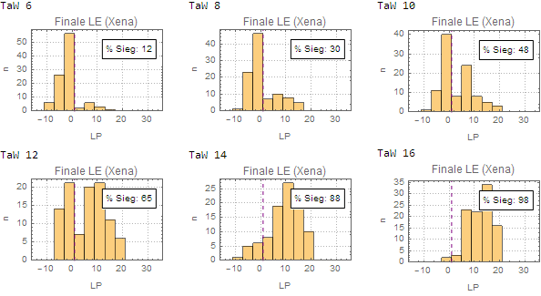\
\
\
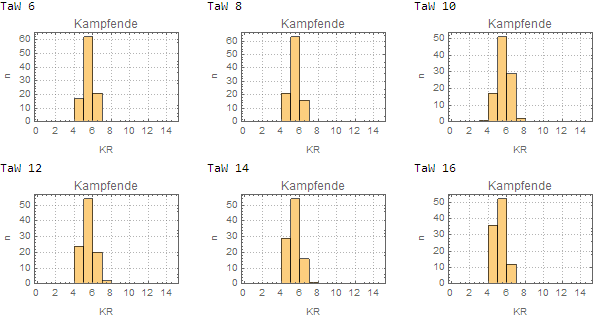

### Schwert & Rüstung gegen Schwert & Rüstung

    Xena: Schwert, Kettenhemd
    Zoltan: Schwert, Kettenhemd, TaW 10

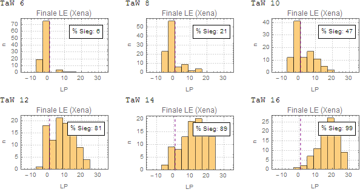\
\
\
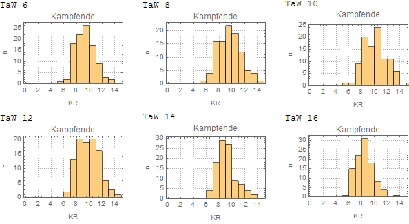

### Schwert & Rüstung gegen Schwert

    Xena: Schwert, Kettenhemd
    Zoltan: Schwert, TaW 10

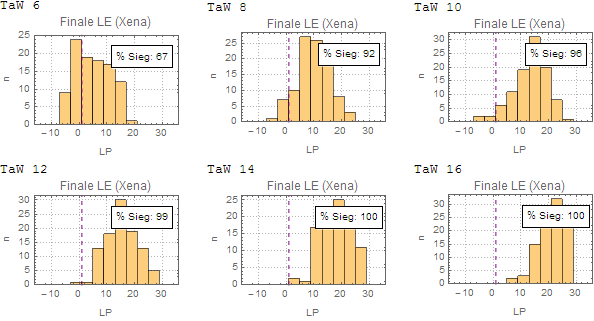\
\
\
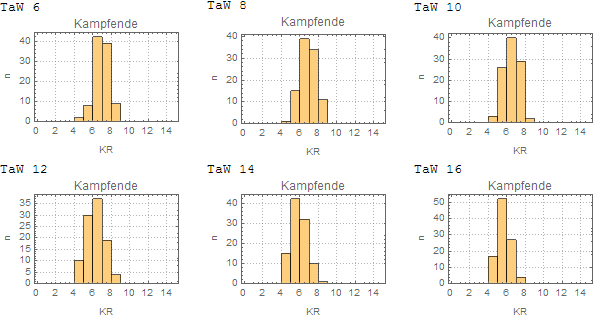

### Schwert gegen Schwert & Rüstung

    Xena: Schwert
    Zoltan: Schwert, Kettenhemd, TaW 10
    
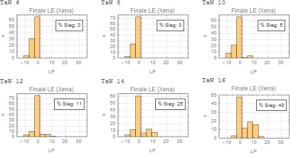\
\
\
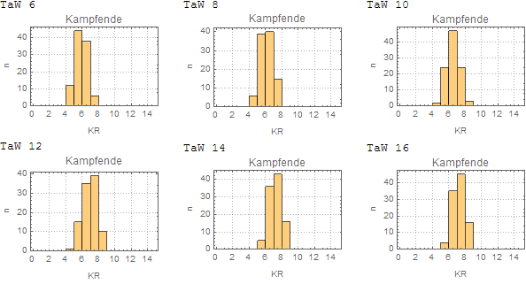

### Schwert/Todesschlag gegen Schwert & Rüstung

    Xena: Schwert, Todesschlag
    Zoltan: Schwert, Kettenhemd, TaW 10

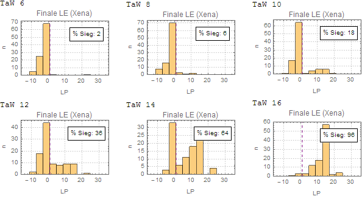\
\
\
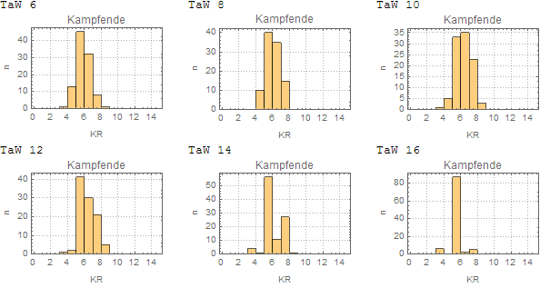

### Axt gegen Schwert

    Xena: Barbarenstreitaxt
    Zoltan: Schwert, TaW 10

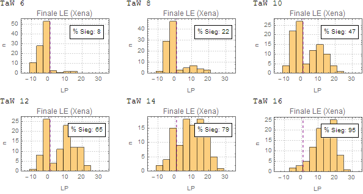\
\
\
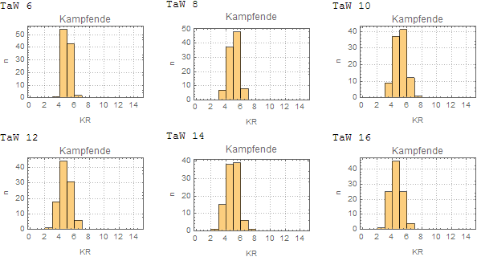

### Axt gegen Schwert & Rüstung

    Xena: Barbarenstreitaxt
    Zoltan: Schwert, Kettenhemd, TaW 10

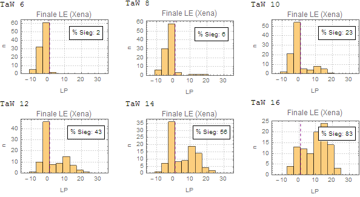\
\
\
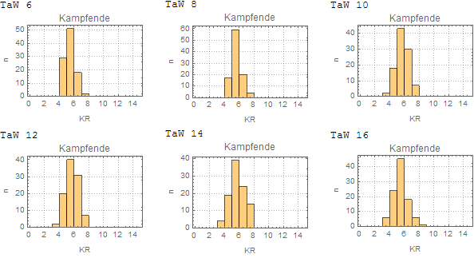

### Axt/Todesschlag gegen Schwert & Rüstung

    Xena: Barbarenstreitaxt, Todesschlag
    Zoltan: Schwert, Kettenhemd, TaW 10

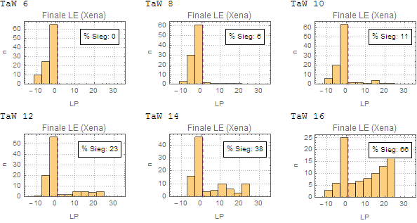\
\
\
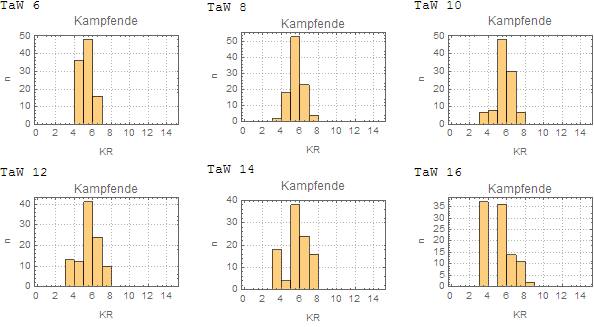

### Axt & Rüstung gegen Schwert & Rüstung

    Xena: Barbarenstreitaxt, Kettenhemd
    Zoltan: Schwert, Kettenhemd, TaW 10

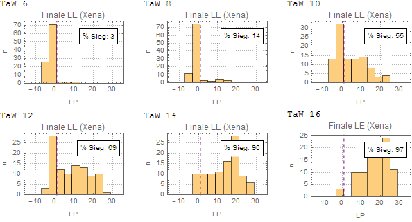\
\
\
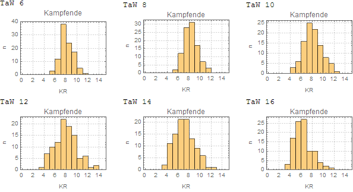

### Schwert gegen 2 x Dolch

    Xena: Schwert
    Zoltan: Dolch, TaW 6
    Tibald: Dolch, TaW 6
    
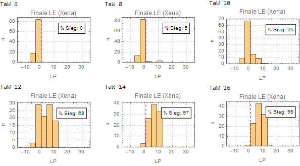\
\
\
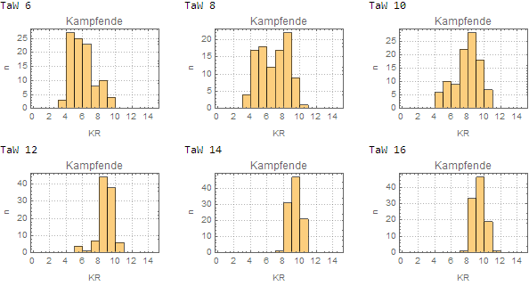

### Schwert & Rüstung gegen 2 x Dolch

    Xena: Schwert, Kettenhemd
    Zoltan: Dolch, TaW 6
    Tibald: Dolch, TaW 6
    
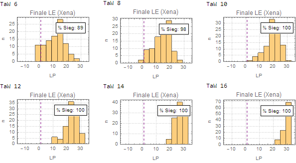\
\
\
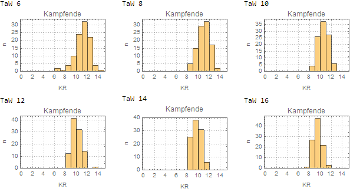

### Schwert gegen 2 x Schwert

    Xena: Schwert
    Zoltan: Schwert, TaW 6
    Tibald: Schwert, TaW 6
    
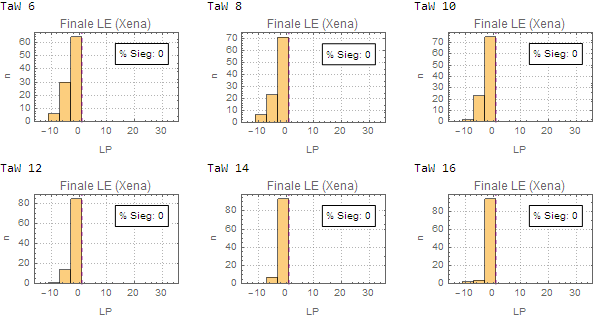\
\
\
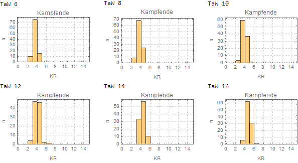

### Schwert & Rüstung gegen 2 x Schwert

    Xena: Schwert, Kettenhemd
    Zoltan: Schwert, TaW 6
    Tibald: Schwert, TaW 6
    
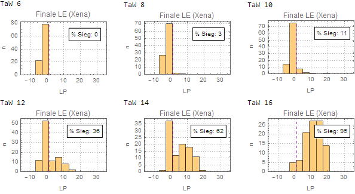\
\
\
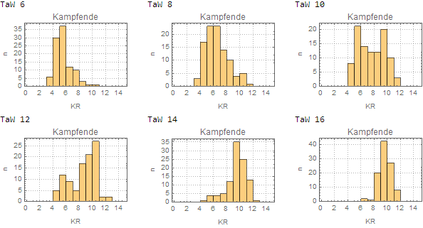
